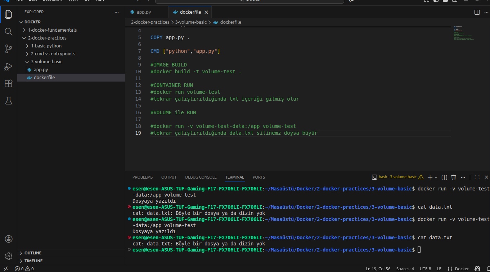
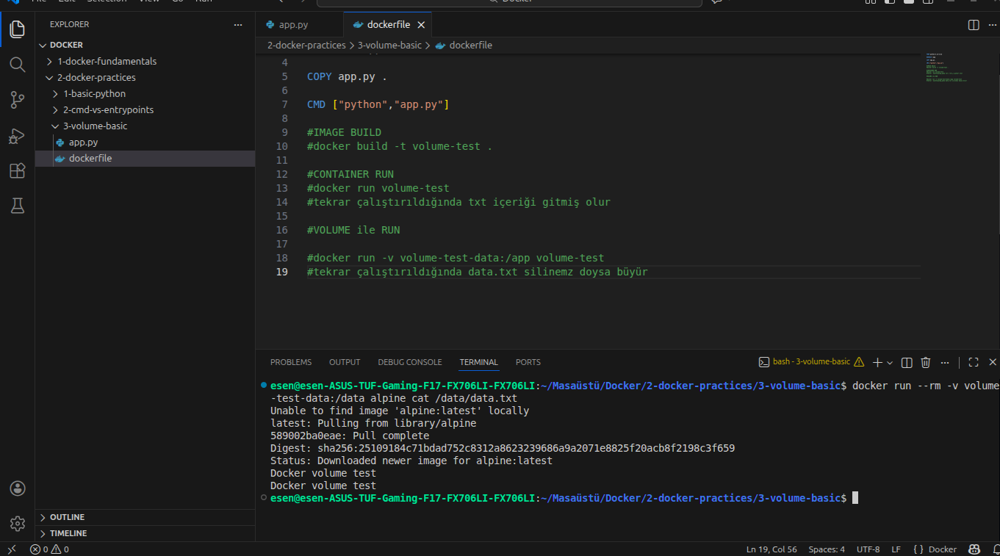

# Docker Pratik 3 – Volume ve Kalıcılık

Bu pratikte Docker container filesystem’inin geçici yapısı ve Docker volume
kullanıldığında verinin nasıl kalıcı hale geldiği uygulamalı olarak
incelenmiştir.

Amaç, container durduktan sonra verinin neden kaybolduğunu ve volume kullanımı
ile bu davranışın nasıl değiştiğini net şekilde gözlemlemektir.

---

## Kullanılan Uygulama

Container içinde çalışan Python uygulaması, her çalıştırıldığında aynı dizin
altında bir dosyaya metin yazmaktadır.

Uygulama çalışmasını tamamladıktan sonra sona erer ve container durur.
Bu yapı, container yaşam döngüsü ile veri kalıcılığı arasındaki ilişkiyi
gözlemlemek için bilinçli olarak seçilmiştir.

---

## Volume Kullanmadan Çalıştırma

İlk aşamada container herhangi bir volume bağlanmadan çalıştırılmıştır.

Kullanılan komut:

docker run volume-test

Bu çalıştırmada:
- Dosya container içindeki filesystem üzerinde oluşturulmuştur
- Container ana process’i tamamlandıktan sonra durmuş ve kapatılmıştır
- Dosya yalnızca container yaşam süresi boyunca var olmuştur

Container durduktan sonra host üzerinde dosyaya erişilmeye çalışıldığında
dosya bulunamamıştır. Bu durum, container filesystem’inin geçici olduğunu
göstermektedir.

Aşağıdaki çıktıda container çalıştıktan sonra dosyanın host üzerinde
erişilemediği görülmektedir:

---

## Volume Kullanarak Çalıştırma

İkinci aşamada aynı image Docker volume bağlanarak çalıştırılmıştır.

Kullanılan komut:

docker run -v volume-test-data:/app volume-test

Bu çalıştırmada:
- Container içindeki çalışma dizini bir Docker volume’a bağlanmıştır
- Dosya container yerine volume üzerinde oluşturulmuştur
- Container durduktan sonra veri silinmemiştir

Dosya içeriği, ayrı bir container kullanılarak volume üzerinden
okunabilmiştir. Bu durum, verinin container yaşam döngüsünden
bağımsız hale geldiğini göstermektedir.

Aşağıdaki çıktıda container durmasına rağmen volume içindeki dosyanın
erişilebilir olduğu görülmektedir:

---
