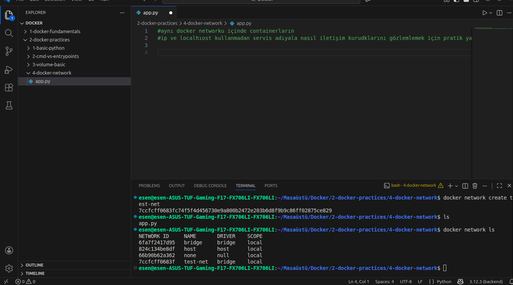
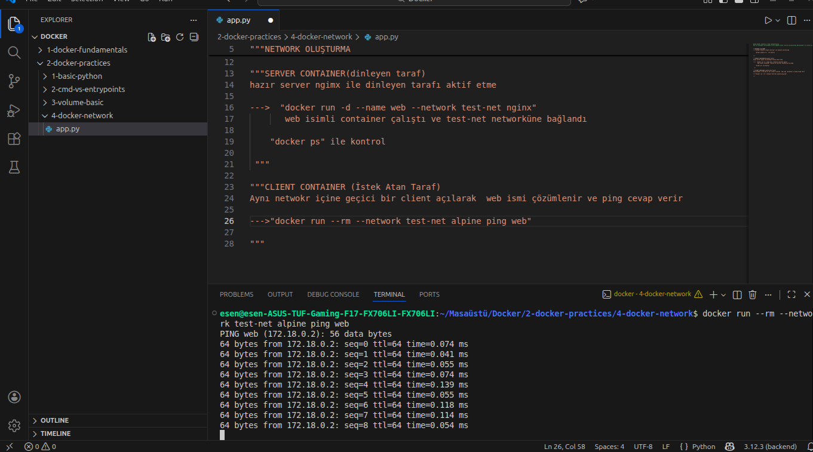
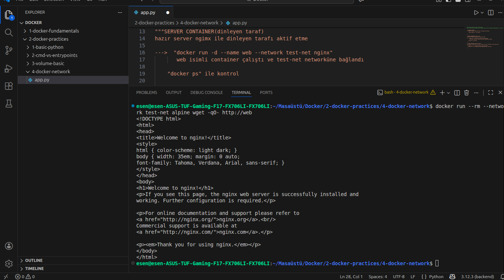
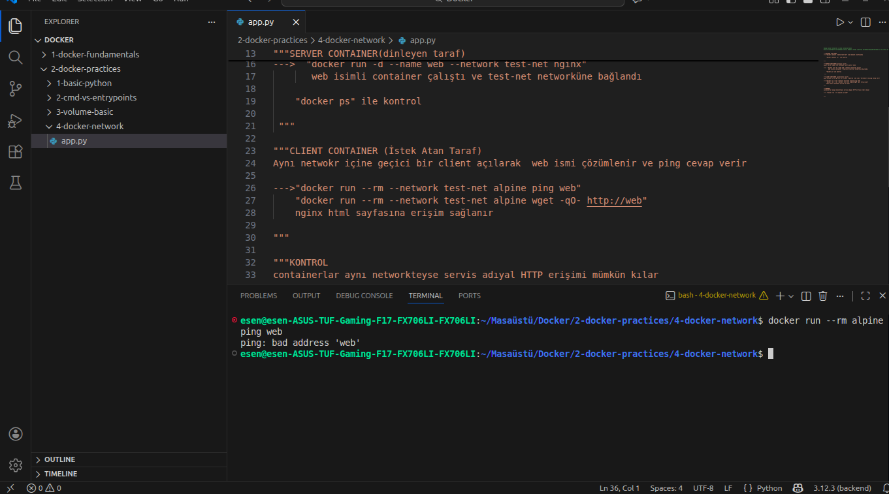

# Docker Pratik 4 – Docker Network

Bu pratikte aynı Docker network’ü içinde çalışan container’ların,
IP adresi veya localhost kullanmadan servis adı üzerinden nasıl
iletişim kurabildiği gözlemlenmiştir.

Amaç, Docker network kavramını uygulamalı olarak görmek ve
container’lar arası iletişimin nasıl sağlandığını netleştirmektir.

---

## Network Oluşturma

İlk olarak izole bir Docker network oluşturulmuştur.

Kullanılan komut:

docker network create test-net

Oluşturulan network’ün kontrolü için aşağıdaki komut kullanılmıştır:

docker network ls

Bu adımda test-net isimli network’ün başarıyla oluşturulduğu görülmüştür.

---

## Server Container (Dinleyen Taraf)

Dinleyen servis olarak hazır bir nginx container’ı kullanılmıştır.

Aşağıdaki komut ile web isimli container oluşturulmuş ve test-net
network’üne bağlanmıştır:

docker run -d --name web --network test-net nginx

Container’ın çalıştığı docker ps komutu ile doğrulanmıştır.

---

## Client Container (İstek Atan Taraf)

Aynı network içinde geçici bir client container çalıştırılarak
web servisine istek atılmıştır.

Öncelikle ping ile servis adı çözümlenmiştir:

docker run --rm --network test-net alpine ping web

Bu aşamada web servis adına başarıyla erişildiği görülmüştür.

---

## HTTP Üzerinden Erişim

Ping kontrolünden sonra HTTP üzerinden nginx servisine erişim
test edilmiştir.

Kullanılan komut:

docker run --rm --network test-net alpine wget -qO- http://web

Bu komut sonucunda nginx varsayılan HTML sayfasının çıktısı
alınmıştır.

---

## Network Olmadan Kontrol

Aynı istek bu sefer herhangi bir Docker network belirtilmeden
çalıştırılmıştır.

Kullanılan komut:

docker run --rm alpine ping web

Bu durumda web servis adına erişilememiş ve bad address hatası
alınmıştır.

Bu sonuç, container’ların yalnızca aynı Docker network içinde
birbirlerini servis adıyla çözümleyebildiğini göstermektedir.

---

