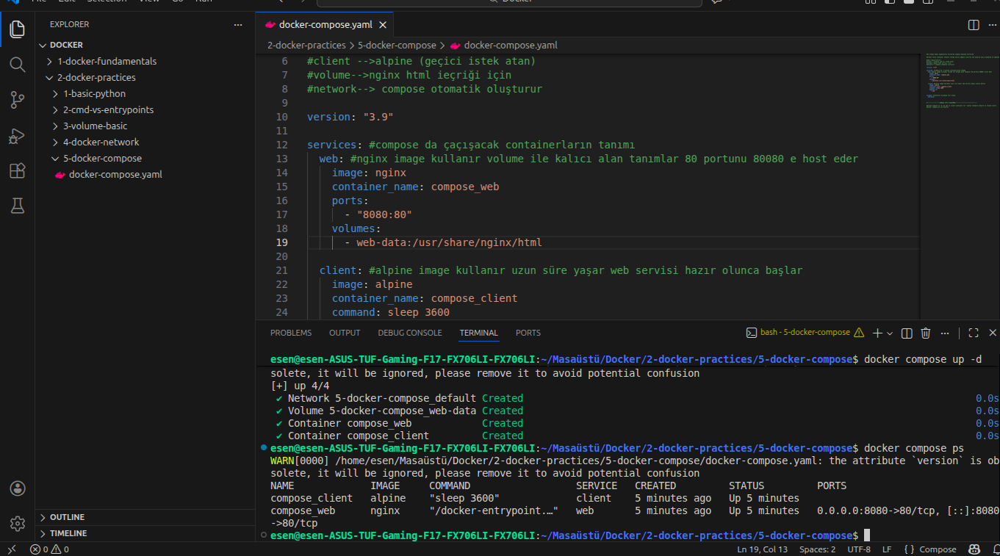
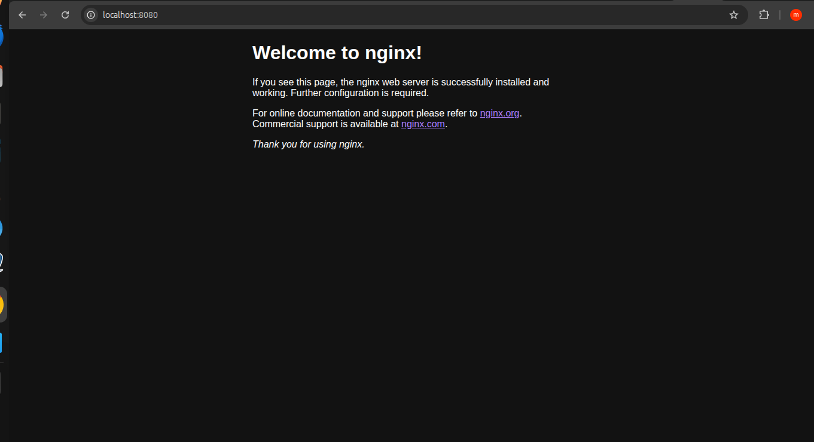
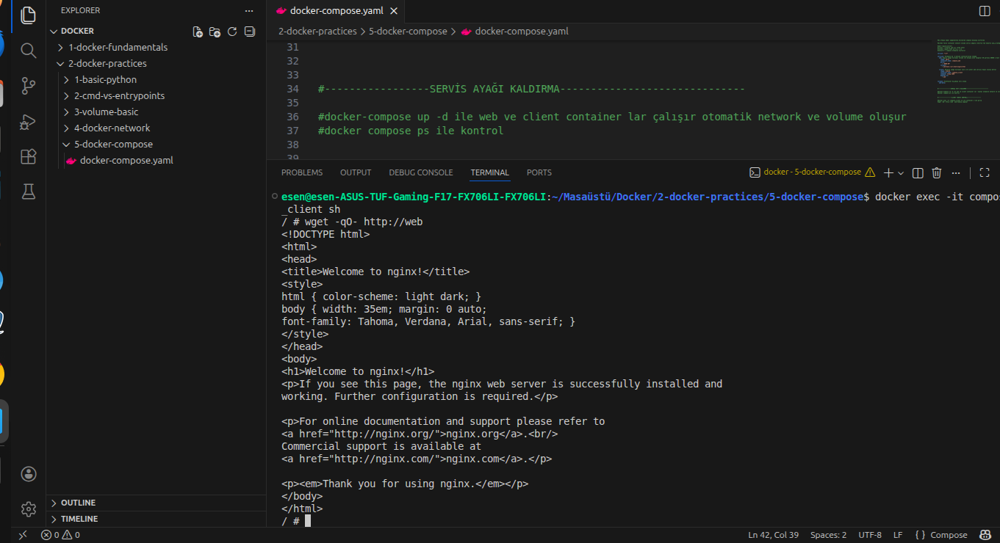

# Docker Compose – Pratik 5

Bu pratikte Docker Compose kullanılarak birden fazla container’ın tek bir yapı altında nasıl yönetildiği gözlemlenmiştir. Amaç; daha önce ayrı ayrı öğrendiğimiz image, container, network ve volume kavramlarının Compose ile birlikte gerçek dünyaya daha yakın bir şekilde nasıl kullanıldığını anlamaktır.

Bu çalışmada iki servis kullanılmıştır:
- Web servisi (nginx)
- Client servisi (alpine)

Docker Compose, bu servisler için gerekli olan network ve volume yapılarını otomatik olarak oluşturur ve servisler arası bağımlılıkları tek bir dosya üzerinden yönetir.

---

## Docker Compose Yapısının Mantığı

Docker Compose; birden fazla container’ı:
- tek komutla ayağa kaldırmak,
- aynı network içine almak,
- volume tanımlarını merkezi olarak yapmak,
- servisler arası bağımlılıkları tanımlamak

için kullanılan bir orkestrasyon aracıdır.

Bu pratikte:
- Manuel docker run komutları yerine
- docker-compose.yaml dosyası kullanılmıştır.

---

## Web Servisinin Ayağa Kaldırılması

Web servisi olarak nginx image’ı kullanılmıştır.

Bu servis:
- 80 portunu dinler
- Host makinede 8080 portuna yönlendirilmiştir
- Kalıcı veri için volume kullanır

Docker Compose çalıştırıldığında:
- web container oluşturulur
- gerekli volume otomatik yaratılır
- default bir network oluşturulur

Bu aşamaya ait docker compose çıktısı:

---

## Localhost Üzerinden Web Servisini Kontrol Etme

Web servisi host makineye port yönlendirmesi ile açıldığı için tarayıcıdan kontrol edilmiştir.

- http://localhost:8080 adresi üzerinden
- nginx default HTML sayfasına erişim sağlanmıştır

Bu kontrol, servisin dış dünyaya açık şekilde çalıştığını gösterir.

---

## Client Servisi ile Container İçinden Kontrol

Client servisi olarak alpine image kullanılmıştır.

Bu servis:
- Aynı Docker Compose network’ü içindedir
- Web servisine servis adı üzerinden erişebilir

Client container içine girilerek:
- web servisine HTTP isteği atılmıştır
- IP veya localhost kullanılmamıştır
- doğrudan servis adı (web) kullanılmıştır

Bu durum Docker Compose’un otomatik DNS çözümlemesini sağladığını gösterir.

Client tarafındaki kontrol çıktısı:

---

## Servisler Arası İletişim Sonucu

Bu pratik sonucunda şunlar net olarak gözlemlenmiştir:

- Docker Compose aynı network içindeki container’lara otomatik DNS sağlar
- Servisler IP bilmeden, servis adıyla haberleşebilir
- Volume ve network tanımları manuel işlem gerektirmeden yönetilir
- docker-compose.yaml gerçek dünyadaki mikroservis mimarisinin temelini oluşturur

---
